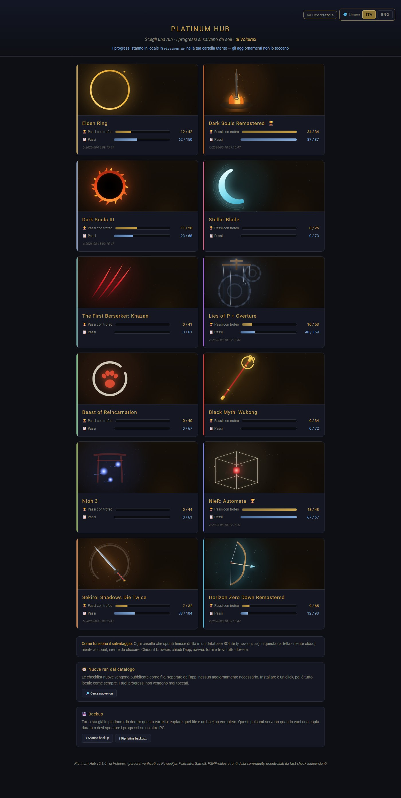
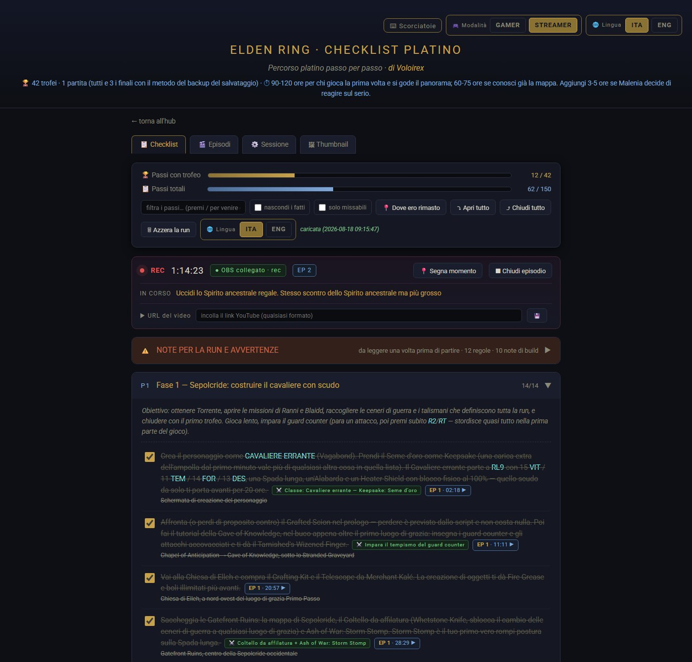
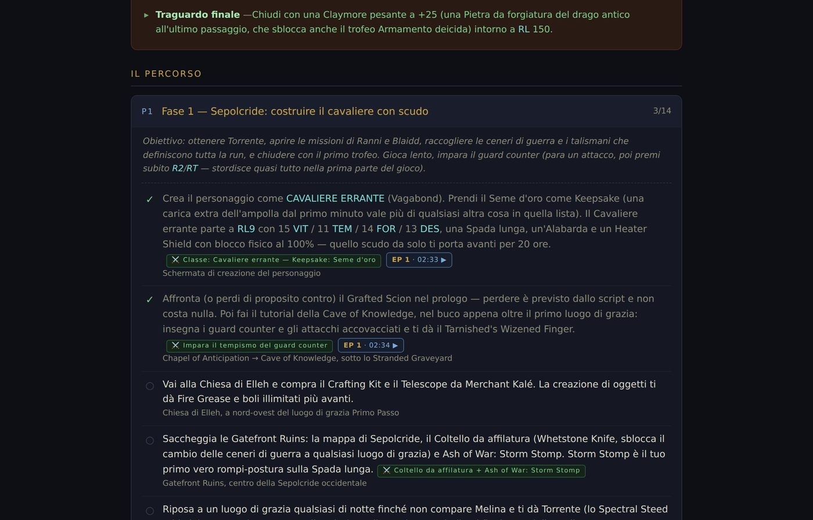

# Platinum Hub

**Il platino non si perde per bravura. Si perde perché a metà del gioco non ti ricordi più cosa hai fatto.**

Platinum Hub è l'app che tiene il filo al posto tuo: dieci run platino verificate passo per passo, i progressi che si salvano da soli, e — se registri o streammi — ogni casella che spunti diventa un timestamp del video, un capitolo YouTube e una guida cliccabile che porta al minuto esatto in cui quella cosa è successa.

Gira sul tuo PC. Non chiede un account, non manda niente a nessuno, non ha pubblicità. È gratis.

**→ [voloire.github.io/platinumhub](https://voloire.github.io/platinumhub/)** — la pagina di presentazione, se ti serve un link da condividere.

<p align="center">
  
</p>

---

## Perché esiste

Una platinum run dura fra le trenta e le centoventi ore, spalmate su settimane. In mezzo c'è la vita vera. Quando riaccendi la console il martedì sera, le domande sono sempre le stesse: *dove ero rimasto, cosa non devo dimenticare qui, e questa cosa la posso ancora fare o l'ho persa per sempre?*

Le guide online rispondono, ma sono muri di testo che non sanno niente di te. Un foglio di calcolo sa dove sei ma non sa cosa succede dopo. Platinum Hub fa le due cose insieme.

## Cosa fa

### Le checklist

- **Dieci giochi**, 865 passi di cui 389 fanno scattare un trofeo — Elden Ring, Dark Souls Remastered, Dark Souls III, Stellar Blade, The First Berserker: Khazan, Lies of P + Overture, Beast of Reincarnation, Black Myth: Wukong, Nioh 3, NieR: Automata.
- **Ogni passo ti dice dove sei, cosa fare e cosa scatta**: posizione, trofeo associato, e l'avviso ⚠ **prima** del punto di non ritorno, non dopo.
- **Bilingue italiano/inglese**, interfaccia *e* contenuti. I nomi in gioco sono quelli ufficiali: 1.137 termini verificati sulle liste trofei italiane di Sony. Dove il nome italiano non era verificabile resta l'inglese, di proposito — un nome inglese giusto ti fa trovare l'oggetto, uno italiano inventato te lo fa cercare a vuoto.
- **Niente glitch, niente skip, niente build copiate da una tier list.** Ogni route è pensata per essere rifatta da un giocatore normale.
- Filtri, ricerca, "dove ero rimasto", note libere per ogni run, e una sezione richiudibile con le regole d'oro e la build spiegata a punti.

### Se registri o streammi

<p align="center">
  
</p>

- **Si collega a OBS** (obs-websocket v5) e legge il timecode reale della registrazione o della diretta. Senza OBS funziona lo stesso, con un cronometro interno.
- **Spunti una casella, nasce un timestamp.** L'app segna il task come completato adesso e il successivo come iniziato adesso — così ogni task ha un inizio, che è il punto giusto dove mandare chi clicca.
- **Capitoli YouTube pronti da incollare**, generati dai marker, già in ordine e con i nomi ufficiali dei trofei.
- **Overlay per OBS**: una sorgente Browser trasparente che mostra a schermo il task in corso e il successivo, con durata e posizione configurabili. Funziona a qualsiasi risoluzione, ultrawide compresi.
- **Scorciatoie da tastiera globali**: avvia la registrazione, segna un task fatto, annulla, metti un segnaposto — **senza alt+tab**, con il gioco in primo piano. La conferma compare sull'overlay, dove stai già guardando.
- **Guida pubblicabile**: un pulsante e ottieni una pagina HTML autonoma con lo stato della run e ogni passo linkato al minuto esatto del video giusto. Modificabile a mano, da mettere dove vuoi.

<p align="center">
  
</p>

### Come è fatto

- **Zero dipendenze.** Solo la libreria standard di Python 3: niente da installare, niente da aggiornare, niente che si rompe fra sei mesi.
- **I tuoi dati restano tuoi**: un file SQLite nella tua cartella utente. Nessun cloud, nessuna telemetria, nessun account. Backup con un pulsante.
- **Le checklist esistono anche come file HTML singoli**, che si aprono a doppio clic senza far partire niente.

## Scaricalo

Ultima versione: **[Releases](../../releases/latest)** → `PlatinumHub-vX.Y.Z-win-x64.zip`.

Scompatti in una cartella qualsiasi e avvii `PlatinumHub.exe`. Non serve installare Python. L'app ti avvisa da sola quando esce una versione nuova; i progressi stanno nella cartella utente, quindi puoi scompattare la versione nuova sopra la vecchia senza perdere niente.

> **Windows mostrerà un avviso al primo avvio** ("Windows ha protetto il PC"): *Ulteriori informazioni* → *Esegui comunque*. L'eseguibile non è firmato, perché un certificato di code signing costa un canone annuale e richiede un'identità aziendale verificata — e questo è il progetto gratuito di una persona sola. In compenso ogni release pubblica lo **SHA256** dello zip, e il file è costruito da una GitHub Action di cui puoi leggere il log riga per riga: puoi verificare che il binario venga esattamente dal codice che stai leggendo.

In alternativa c'è la cartella con `app.py` e il doppio clic su `run.bat`: serve solo Python 3.

## Licenza — pubblico non vuol dire open source

**Questo repository è pubblico, ma il progetto non è open source.** Il codice è visibile perché tu possa vedere cosa fa il programma prima di eseguirlo, e perché tu possa fidarti dell'eseguibile che scarichi. I diritti restano all'autore.

Puoi usarlo gratis quanto vuoi e studiarne il codice. Non puoi ridistribuirlo, rivenderlo, pubblicarne una tua versione o usarlo a scopo commerciale. I termini esatti sono in [LICENSE](LICENSE).

## Contribuire

Le pull request sul codice non vengono accettate. **Le segnalazioni e le correzioni ai contenuti delle checklist sì, e sono la cosa più utile che puoi fare**: se giocando trovi un passo impreciso, un nome sbagliato o un missabile non segnalato, aprire una issue vale più di dieci righe di codice. Vedi [CONTRIBUTING.md](CONTRIBUTING.md).

Per un problema di sicurezza: [SECURITY.md](SECURITY.md), senza aprire una issue pubblica.

## Per chi mette le mani nel repository

| | |
|---|---|
| Come funziona la CI | [docs/CI.md](docs/CI.md) |
| Come si pubblica una versione | [docs/RELEASE.md](docs/RELEASE.md) |
| Cosa cambia a ogni versione | [CHANGELOG.md](CHANGELOG.md) |
| Come sono costruite le route | [docs/ROUTES.md](docs/ROUTES.md) |

```bash
python app.py                              # avvia l'app -> http://127.0.0.1:8787
python -m pip install -r requirements-dev.txt
python -m ruff check .                     # lint
python -m pytest                           # test  (130, ~7 secondi)
python tools/smoke_check.py                # l'app parte e risponde?
```

---

<sub>Platinum Hub è un progetto indipendente. Non è affiliato né approvato da FromSoftware, Bandai Namco, Team Ninja, Square Enix, Game Science, Shift Up, Neowiz, Sony Interactive Entertainment, Valve o OBS Project. I nomi dei giochi e dei trofei appartengono ai rispettivi proprietari e sono citati a scopo descrittivo.</sub>
